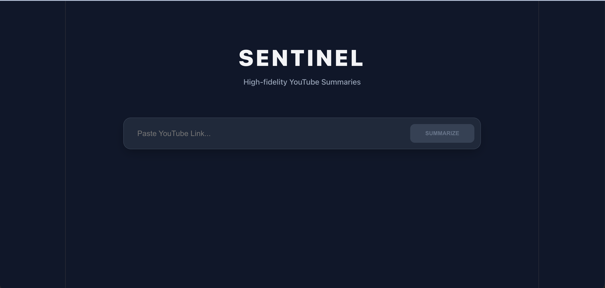
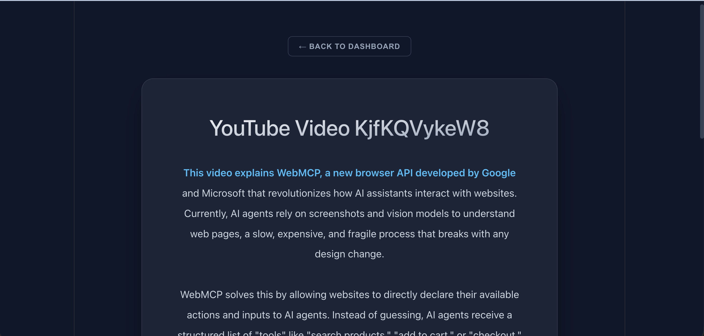
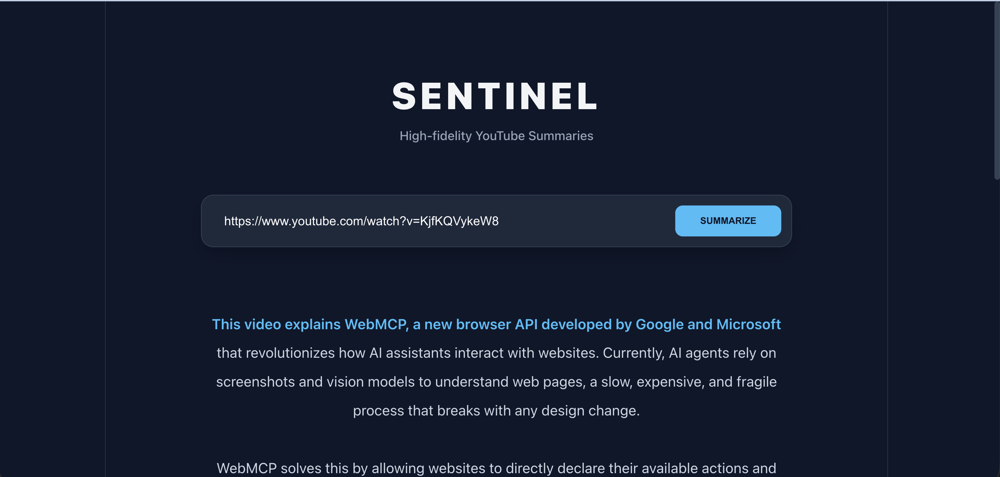
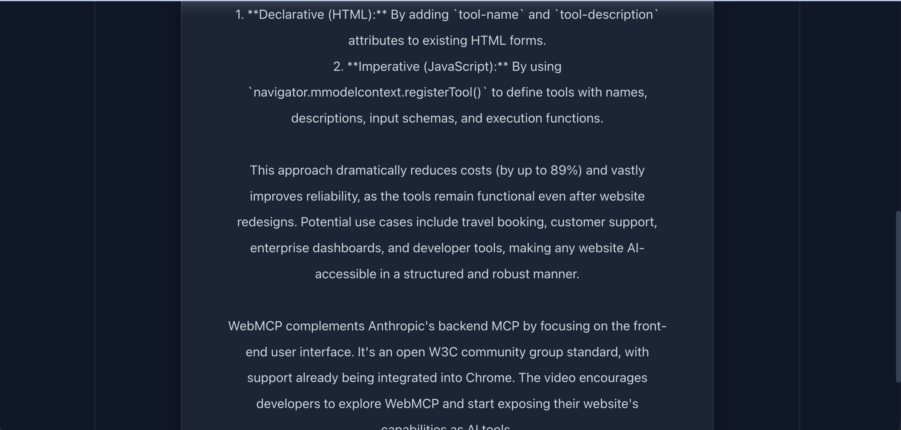
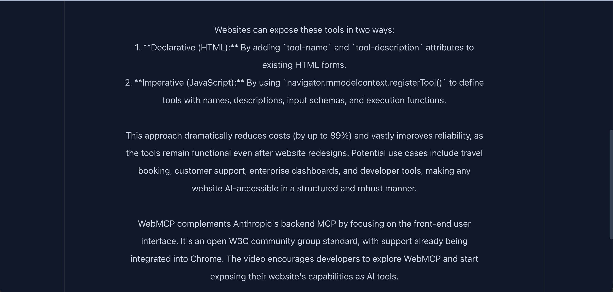
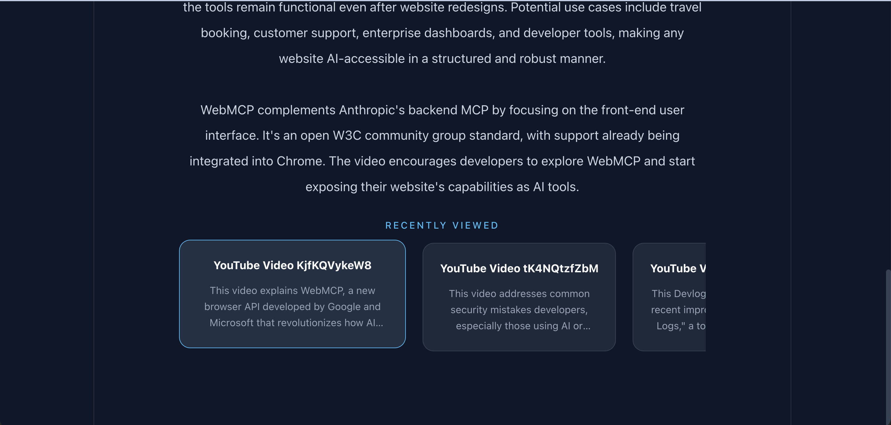

# SENTINEL AI 🛰️
**High-fidelity YouTube Summarization Platform**

Sentinel is a cloud-native intelligence tool that distills long-form YouTube videos into concise, professional summaries using Google Gemini AI.

### 🚀 Key Features
- **Asynchronous Processing:** Powered by Spring Boot and Redis (Producer-Consumer).
- **Cache-First Architecture:** Instant results for previously processed videos via PostgreSQL lookup.
- **Modern UI:** Built with React & Framer Motion for a "Glassmorphic" Apple-style aesthetic.
- **Scalable Design:** Decoupled Ingestor and Worker services.

### 🛠️ Tech Stack
- **Frontend:** React, React Router, Axios, CSS3 (Glassmorphism)
- **Backend:** Spring Boot, Spring Data JPA
- **Storage:** PostgreSQL, Redis
- **AI:** Google Gemini Pro API

### 📸 Previews

| Dashboard | AI Summary View |
| :---: | :---: |
| |
| |
|
|

